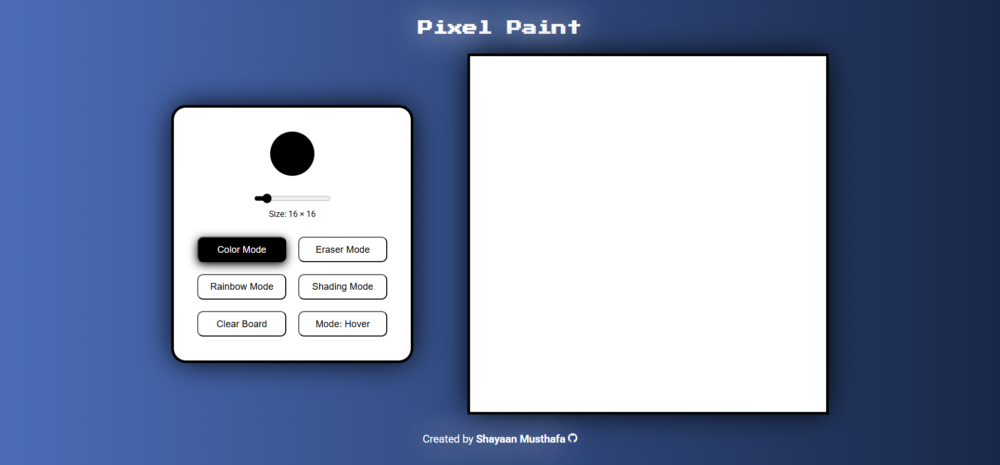

# Pixel Paint (Etch a Sketch)

## About

A Etch a Sketch project built as part of [The Odin Project's Foundations course](https://www.theodinproject.com/lessons/foundations-etch-a-sketch).

**Pixel Paint** is a web-based drawing app inspired by the classic Etch A Sketch.

It allows users to create pixel art on a customizable grid with different drawing modes, including:

- **Color Mode**: Paint with any chosen color.
- **Rainbow Mode**: Apply random vibrant colors to each square.
- **Shading Mode**: Gradually darken squares for a shading effect.
- **Eraser Mode**: Erase parts of your drawing.
- **Clear Board**: Reset the entire grid with one click.
- **Change Draw Mode**: Change between a hover draw mode and a click & drag draw mode.

The grid size is adjustable (from 4×4 up to 100×100), giving you full control over detail and precision.

## Preview

## Technologies Used

- HTML5
- CSS3
- JavaScript (ES6)
- Google Fonts (Press Start 2P, Roboto)

## Credits

**Favicon Icon**

- [Paintbrush icon](https://www.flaticon.com/free-icon/paintbrush_420305) created by Freepik - Flaticon

## Contact

Created by [Shayaan Musthafa](https://github.com/shayaan183).